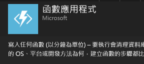
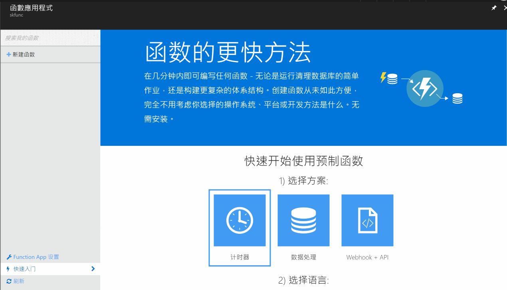
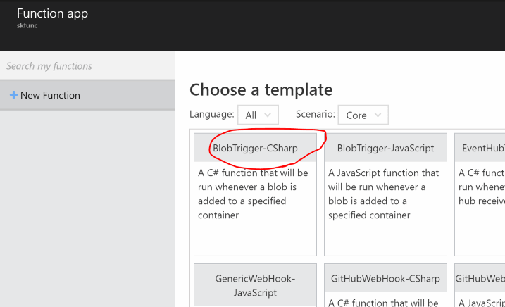
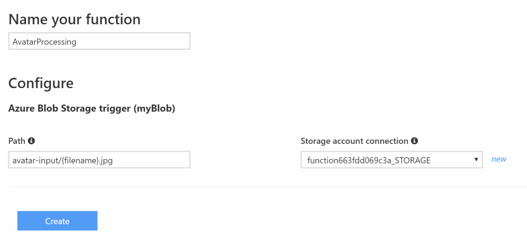
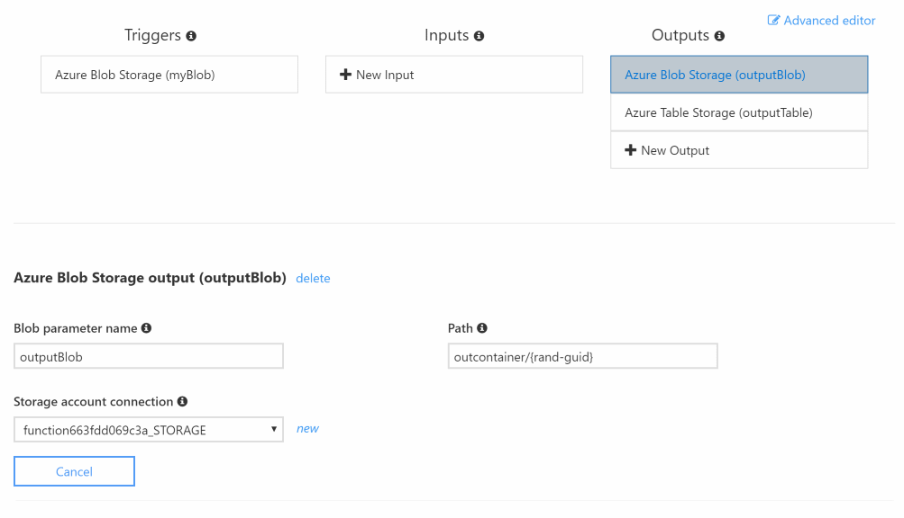

# Azure Functions

這裡透過一個處理圖片的例子示範如何使用 [Azure Functions](https://azure.microsoft.com/zh-tw/services/functions/)。

## 環境準備

  * [Microsoft Azure](https://azure.microsoft.com/) 訂閱帳戶。
  * (選擇性) [Storage Explorer](http://storageexplorer.com/)。
  * (選擇性) [Visual Studio](https://www.visualstudio.com/zh-hant/) 2015/2017。

## 操作步驟

### 建立 Function App

  1. 在 [Azure Portal](https://portal.azure.com/) 中，建立一個 **Function App (函數應用程式)**。

     

  2. 建立完成後，我們可以看到快速入門頁面，這裡可以透過它的指引快速建立一個 Function App 的 _應用程式_，不過這裡我們可以點擊左側面版上的 **New Function** 透過更多範本來建立應用程式。

     

     在範本中我們選擇 _BlobTrigger-CSharp_ 的範本來操作。

     

  3. 選了範本後，完成設定就可以開始寫程式了，這裡除了設定函數名稱之外，由於是從 Blob 儲存體來驅動函數的執行，所以要設定 Blob 中檔案的 pattern，並且標記出參數的位置；而儲存體的位置可以利用 **new** 連結來建立或選擇。

     

     在 **Path** 欄位這裡填了 ```avatar-input/{filename}.png``` 表示只有這樣 pattern 的檔案上傳到 blob 儲存體了才驅動函數的執行，並且把檔名透過 ```filename``` 參數傳入函數。

     最後按下 **Create** 按鈕完成建立。

  4. 剛建好函數時可能會有錯誤訊息，不過這不重要，先點開左側面板中的 **Integrate** 做設定，在這頁你可以設定 _Trigger_、_Input_ 以及 _Output_，而且不只能設定一個 input/output，看你的需求而進行設定。

     

     這裡我們新增兩個個 Output: _Azure Blob Storage_ 以及 _Azure Table Storage_，而進行的設定如下：

     **Azure Blob Storage (Triggers)**

       * **Blob parameter name**: _image_。
       * **Path**: _avatar-input/{filename}.jpg_。
       * **Storage account connection**: 選擇或建立要操作的儲存體帳戶。

     **Azure Blob Storage (Outputs)**

       * **Blob parameter name**: _outputBlob_。
       * **Path**: _avatar-output/{filename}.jpg_。
       * **Storage account connection**: 選擇或建立要操作的儲存體帳戶。

     **Azure Table Storage (Outputs)**

       * **Table parameter name**: _demoTable_。
       * **Table name**: _Demo_。
       * **Storage account connection**: 選擇或建立要操作的儲存體帳戶。

  5. 回到 **Develop** 頁面，將下列程式碼貼入編寫程式碼的區塊：

     ```csharp
     #r "Newtonsoft.Json"
     
     using System;
     using System.IO;
     using System.Net;
     using System.Net.Http;
     using System.Net.Http.Headers;
     using Newtonsoft.Json;
     
     const string FACEAPI_KEY = "<從 Microsoft Cognitive Service 申請>";

     public static async Task Run(byte[] image, string filename, Stream outputBlob, IAsyncCollector<Face> demoTable, TraceWriter log)
     {
         using (var ms = new MemoryStream(image))
         {
             outputBlob.Write(image, 0, image.Length);
         }
       
         string result = await AnalyzeImageAsync(image);
         log.Info(result);
       
         if (String.IsNullOrEmpty(result))
         {
             return;
         }

         ImageData imageData = JsonConvert.DeserializeObject<ImageData>(result);
         foreach (Face face in imageData.Faces)
         {
             face.PartitionKey = "ProfileImageUpload";
             face.RowKey = Guid.NewGuid().ToString();
             await demoTable.AddAsync(face);
         }
     }
     
     static async Task<string> AnalyzeImageAsync(byte[] image)
     {
         using (var client = new HttpClient())
         {
             var content = new StreamContent(new MemoryStream(image));
             var url = "https://api.projectoxford.ai/vision/v1.0/analyze?visualFeatures=Faces";
             client.DefaultRequestHeaders.Add("Ocp-Apim-Subscription-Key", FACEAPI_KEY);
             content.Headers.ContentType = new MediaTypeHeaderValue("application/octet-stream");
             
             var httpResponse = await client.PostAsync(url, content);
             if (httpResponse.StatusCode == HttpStatusCode.OK)
             {
                 return await httpResponse.Content.ReadAsStringAsync();
             }
         }
         return null;
     }
     
     public class ImageData
     {
         public Face[] Faces { get; set; }
     }
     
     public class Face
     {
         public string PartitionKey { get; set; }
         public string RowKey { get; set; }
         public int Age { get; set; }
         public string Gender { get; set; }
     }
     ```
     貼完之後按下 **Save** 看看是否有編譯錯誤的訊息。
     
       > 在儲存程式碼之前，別忘了到 [Microsoft Cognitive Services](http://microsoft.com/cognitive) （免費）申請一組 Face API 的存取金鑰。

  6. 完成後，你可以上傳一張 JPG 檔案到指定的 blob 儲存體，並且放在 ```avatar-input``` 容器下，再回來看看函數應用程式是否正確被驅動執行。

  7. 若順利完成執行，可以使用 Storage Explorer 觀察 Table 儲存體中的 **Demo** table 是否有填入 Microsoft Cognitive Service 回傳的資料。

### 使用 Visual Studio 開發 Function App _（選擇性）_

  (待補)
