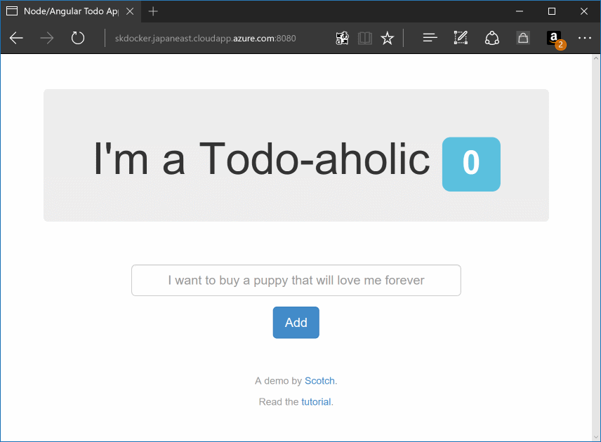
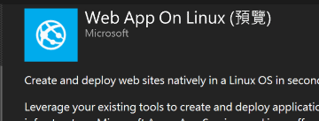
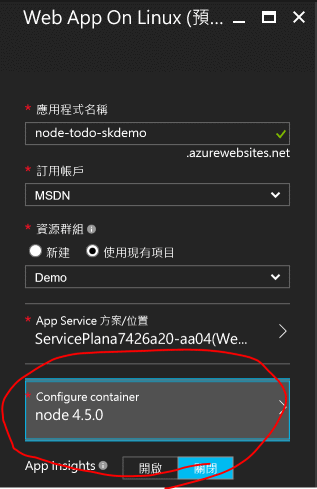
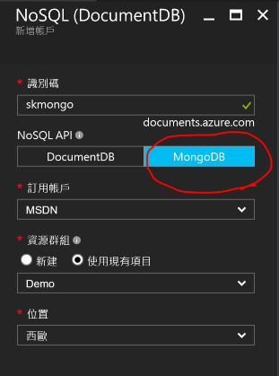
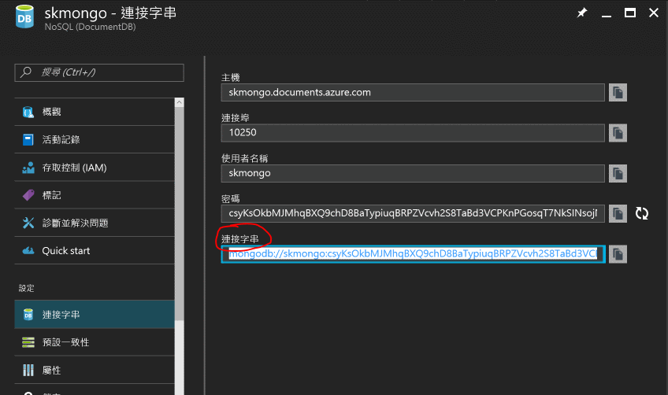
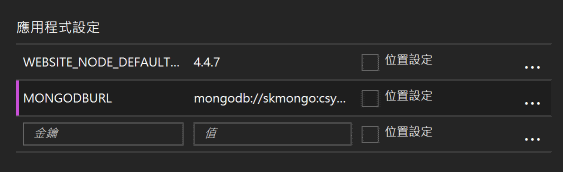
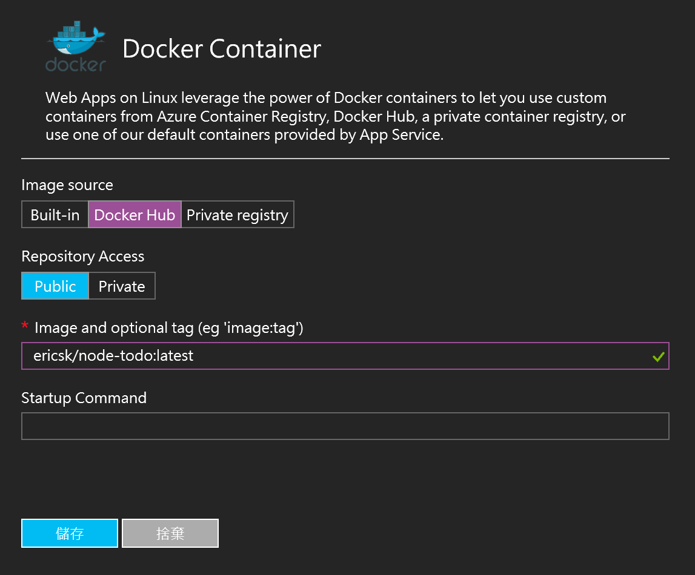

# Web App on Linux

部署一個使用 MEAN (Mongo + Express + Angular + Node) Stack 寫的 Web 應用程式到 Azure Web App on Linux 上。

## 環境準備

  * [Microsoft Azure](https://azure.microsoft.com/) 訂閱帳戶。
  * 安裝 [git](https://git-scm.com/)。
  * [Node.js](https://nodejs.org/en/) 執行環境。
  * 安裝 [MongoDB](https://www.mongodb.com/)。
  * (選擇性) 安裝 [Docker](http://docker.com/) 環境及工具。
  * (選擇性) 註冊 [Docker Hub](https://hub.docker.com/) 帳號。

## 操作步驟

### 修改及執行應用程式 

  1. 這個示範使用 GitHub 上的一個開源專案：[node-todo](https://github.com/scotch-io/node-todo) 來做示範，可以先 fork 或直接 clone 一份在開發機上。
  2. 在專案目錄下執行 ```npm install``` 指令安裝所需套件。
  3. 修改 **server.js** 檔案中連接 MongoDB 的部份，加入從環境變數讀取連接字串的判斷：
     
     ```javascript
     ...
     mongoose.connect( process.env.MONGODBURL || database.localUrl );
     mongoose.connection.on('error', console.error.bind('connection error!'));
     ...
     ```
  4. 確定系統有開啟 MongoDB 服務，接著在專案中執行 ```node server.js``` 把應用程式跑起來，若只有看到這樣的訊息就表示正確運作了：

     ```
     App listening on port 8080
     ```

  5. 接著打開瀏覽器連接到開發環境的 8080 連接埠，應該會看到下圖所示的畫面，這表示我們已經成功執行了一個 MEAN Stack 的應用程式。

     

### 部署應用程式到 Azure Web App (on Linux)

  1. 打開 [Azure Portal](https://portal.azure.com/)，新增服務時選擇 **Web App On Linux**。

     

  2. 建立的過程中，_Configure container_ 的部份留意是選擇 Node，稍後我們再來解釋這個部份的設定。

     

  3. 完成成 Web App on Linux 的建立後，把 node-todo 專案所有的檔案都上傳（可透過 FTP 或 Git 方式部署），完成後打開網站，應該會看到類似在本機執行起來的畫面，但是有點不一樣，在原本該出現 To-Do item 的區塊一直有個讀取中的圖案，這表示資料庫（MongoDB）的部份連接有問題。

  4. 為了讓應用程式順利運作，可以使用 Azure DocumentDB 服務來替代 MongoDB（不必修改程式），只要在建立 DocumentDB 服務時，在 **NoSQL API** 欄位選擇 _MongoDB_ 即可。

       > 別忘了與 Web App on Linux 建立在相同的機房

     

     完成建立後，將此 DocumentDB (MongoDB) 的連接字串複製起來。

     

  5. 回到剛才建立的 Web App on Linux，在 **應用程式設定** 中的 **應用程式設定** 加入一個 MONGODBURL 環境變數，然後把剛才複製的連接字串填入值。

     

  6. 重新啟動 Web App 程式就一切正常了。


### (選擇性) 使用 Docker 部署到 Web App on Linux

  1. 在應用程式的目錄下建立一個 **dockerfile** 的檔案，內容如下：

     ```dockerfile
     FROM mhart/alpine-node
     COPY package.json /tmp/package.json
     RUN cd /tmp && npm install --production
     RUN mkdir -p /usr/src/app && mv /tmp/node_modules /usr/src
     WORKDIR /usr/src/app
     COPY . /usr/src/app
     EXPOSE 8080
     CMD node server.js
     ```

  2. 有了 **dockerfile** 檔案之後，執行下列命令建置 docker image：

     ```
     docker build -f ./dockerfile -t ericsk/node-todo:latest .
     ```

     其中 ```ericsk/nodo-todo``` 可以換成你自己的名稱。建置完成後，可以先執行下列指令確定這個 docker image 可以正確執行：

     ```
     docker run -d -p 8080:8080 ericsk/node-todo
     ```

  3. 接下來你可以把這個 image 放在你自己的 docker registry 裡，或是放上公開的 Docker Hub 上，先使用 ```docker login``` 指令完成身份驗證後，再執行下列指令把 docker image 放上 Docker Hub：

     ```
     docker push ericsk/node-todo:latest
     ```

       > 別忘了換成自己的名稱

  4. 放上 Docker Hub 後，就可以讓 Azure Web App on Linux 去 Docker Hub 拉 image 下來部署，只要回到 **Docker Container** 裡設定成從 Docker Hub （或是自建的 docker registry）拉 docker image 來部署，填入 docker image 的名稱即可。

     

  5. 重新啟動 Web App 後就可以讓它從 docker hub 拿剛才建立好的 docker image 來部署網站了。